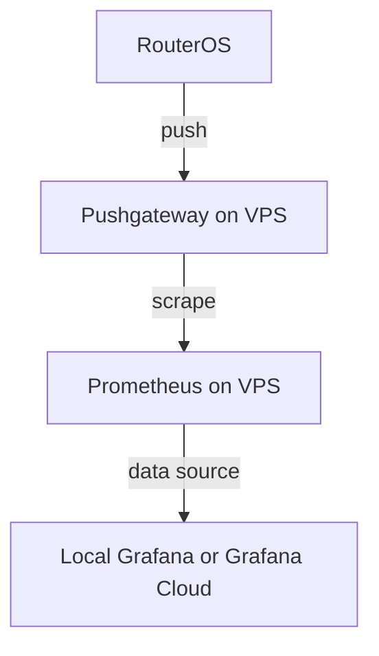

# RouterOS Grafana Monitoring Setup 

Configuration to monitor RouterOS devices using [Prometheus](https://github.com/prometheus/prometheus) and [Grafana](https://grafana.com), with a VPS as an intermediary. Metrics are pushed from RouterOS to a [Pushgateway](https://github.com/prometheus/pushgateway) on the VPS, and Prometheus scrapes the Pushgateway.

## Flow


## VPS Setup
1. Set up a VPS server (e.g., DigitalOcean, AWS, etc.) with Docker installed.
2. Setup a tunnel between your VPS and RouterOS with ZeroTier or other VPN solution.
3. Update the `docker-compose.yml`, `prometheus/prometheus.yml` and `prometheus/web.yml` files with your specific configurations:
    - In `docker-compose.yml`, ensure the config in grafana section, if you want to host Grafana locally, use `grafana` service, if you want to use Grafana Cloud, use the [Private data source connect](https://grafana.com/docs/grafana-cloud/connect-externally-hosted/private-data-source-connect/) with `grafana-pdc-agent`.
    - In `prometheus/prometheus.yml`, add your RouterOS IP address in the `blackbox-exporter` job under `static_configs`. You can add mor endpoint there if you want. Note that the blackbox-exporter is used to ping from your VPS, not your RouterOS Network.
    - In `prometheus/web.yml`, set up basic authentication by hashing your password with the script in the `prometheus-password-hashing` folder.
4. Start the monitoring stack with Docker
    ```bash
    docker-compose up -d
    ```
5. Access Grafana at `http://<your_vps_ip>:3000` (or your Grafana Cloud instance) and log in with the default credentials (`admin`/`admin` or your Grafana Cloud credentials). Change the password if prompted.
6. If using Cloud Grafana, set up the [Private data source connect](https://grafana.com/docs/grafana-cloud/connect-externally-hosted/private-data-source-connect/) to connect your VPS Prometheus to Grafana Cloud.
7. Add Prometheus as a data source in Grafana, pointing to `http://prometheus:9090` (if using local Grafana), select **Basic Auth** as the authentication type and select the Private data source connect network **Private data source connect network** in the end if you are using Cloud Grafana.
8. Add dashboards in Grafana. You can create your own or import existing ones from the Grafana dashboard repository. 
    * Example Query to get RouterOS ping metrics:
        ```
        routeros_ping_latency{job="routeros", target="1.1.1.1"}
        ```
    * Example Query to get blackbox-exporter ping metrics:
        ```
        probe_duration_seconds{instance="<your router ip>"} * 1000
        ```

## RouterOS Script Setup (For RouterOS v7)

Add the following script in your RouterOS to push metrics to your VPS Pushgateway endpoint.
Best setup:
1. Create a script with the content below, name it `push-metrics`. With permission policy `read` and `test`.  

    ```
    # Format Latency Number
    :local pingLatency do={
      :local target $1
      :local result [/ping $target count=1 as-value] 
      :if ([:len  ($result->"time")] = 0 ) do={
        :return "NaN"
      }
      :local resultNum [:tonum  ( $result->"time" *1000000)]
      :return ($resultNum/1000 . "." . $resultNum%1000)
    }

    # Basic info
    :local routerName "home-router"
    :local vps "http://<your vps ip>:9091"

    # Ping your desired host
    :local ping01 [$pingLatency "8.8.8.8"]
    :local ping02 [$pingLatency "1.1.1.1"]

    # Ping with domain name (for example google.com)
    :local ip03 [:resolve "google.com"]
    :local ping03 [$pingLatency $ip03]

    # Other Mertics
    :local connCount [/ip firewall connection print count-only]

    # Body builder (Update according to your ping above)
    :local body ("routeros_ping_latency{target=\"8.8.8.8\"} " . $ping01 . "\n")
    :set body ($body . "routeros_ping_latency{target=\"1.1.1.1\"} " . $ping02. "\n")
    :set body ($body . "routeros_ping_latency{target=\"google.com\"} " . $ping03. "\n")

    :set body ($body . "routeros_fw_connections " . $connCount . "\n")

    # Send to VPS
    /tool fetch url=($vps . "/metrics/job/routeros/instance/" . $routerName) \
        http-method=post http-data=$body output=none
    ```
2. Modify the script to fit your needs. You can add more metrics as you want. Make sure to update vps variable with your VPS IP address or domain name.
3. Schedule the script to run every 30 seconds.

    ```
    /system scheduler
    add name="push-metrics" interval=30s on-event=push-metrics policy=read,test
    ```
