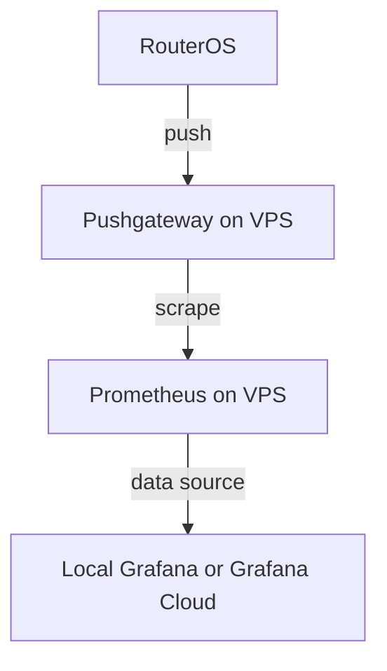

# RouterOS Grafana Monitoring Setup 

Configuration to monitor RouterOS devices using [Prometheus](https://github.com/prometheus/prometheus) and [Grafana](https://grafana.com), with a VPS as an intermediary. Metrics are pushed from RouterOS to a [Pushgateway](https://github.com/prometheus/pushgateway) on the VPS, and Prometheus scrapes the Pushgateway.

## Flow


## VPS Setup
1. Set up a VPS server (e.g., DigitalOcean, AWS, etc.) with Docker installed.
2. Setup a tunnel between your VPS and RouterOS with ZeroTier or other VPN solution.
3. Update the `docker-compose.yml`, `prometheus/prometheus.yml` and `prometheus/web.yml` files with your specific configurations:
    - In `docker-compose.yml`, ensure the config in grafana section, if you want to host Grafana locally, use `grafana` service, if you want to use Grafana Cloud, use the [Private data source connect](https://grafana.com/docs/grafana-cloud/connect-externally-hosted/private-data-source-connect/) with `grafana-pdc-agent` service.
    - In `prometheus/prometheus.yml`, add your RouterOS IP address in the `blackbox-exporter` job under `static_configs.targets`. You can add more endpoint there if you want. Note that the blackbox-exporter is used to ping from your VPS, not your RouterOS Network.
    - In `prometheus/web.yml`, set up basic authentication by hashing your password with the script in the `prometheus-password-hashing` folder.
4. Start the monitoring stack with Docker
    ```bash
    docker-compose up -d
    ```
5. Access Grafana at `http://<your_vps_ip>:3000` (or your Grafana Cloud instance) and log in with the default credentials (`admin`/`admin` or your Grafana Cloud credentials). Change the password if prompted.
6. If using Cloud Grafana, set up the [Private data source connect](https://grafana.com/docs/grafana-cloud/connect-externally-hosted/private-data-source-connect/) to connect your VPS Prometheus to Grafana Cloud.
7. Add Prometheus as a data source in Grafana, pointing to `http://prometheus:9090` (if using local Grafana), select **Basic Auth** as the authentication type and select the Private data source connect network **Private data source connect network** in the end if you are using Cloud Grafana.
8. Add dashboards in Grafana. You can create your own or import existing ones from the Grafana dashboard repository. 
    * Example Query to get RouterOS ping metrics:
        ```
        routeros_ping_latency{job="routeros", target="1.1.1.1"}
        ```
    * For other metrics, you can import the dashboard with `grafana/router-stats.json` file in this repo to get started.

## RouterOS Script Setup (For RouterOS v7)

Add the following script in your RouterOS to push metrics to your VPS Pushgateway endpoint.
Best setup:
1. Create a script with the content in `routeros/push-metric.rsc`, name it `push-metrics`. With permission policy `read` and `test`.  
2. Modify the script to fit your needs.
    * Make sure to update vps variable with your VPS IP address or domain name. You can also change the routerName variable to identify your router in Grafana.  
        ```
        # Basic info
        :local routerName "home-router"
        :local vps "http://<your vps ip>:9091"
        ```
    * Add or remove metrics as needed. The example script includes CPU load, memory usage, and other relevant metrics.
    * For ping metrics, you can change the target IP address and TAG for your preference in the following section.
        ```
        # For Tag DNS
        :local pingDNSTargets {"8.8.8.8";"1.1.1.1"}
        :foreach t in=$pingDNSTargets do={
            :local latency [$pingLatency $t]
            :set pingMetrics ($pingMetrics . "routeros_ping_latency{target=\"$t\",tag=\"DNS\"} $latency\n")
        }

        # For Tag WEB
        :local pingWEBTargets {"google.com"}
        :foreach t in=$pingWEBTargets do={
            :local ip [:resolve $t]
            :local latency [$pingLatency $ip]
            :set pingMetrics ($pingMetrics . "routeros_ping_latency{target=\"$t\",tag=\"WEB\"} $latency\n")
        }
        ```
3. Schedule the script to run every 30 seconds.

    ```
    /system scheduler
    add name="push-metrics" interval=30s on-event=push-metrics policy=read,test
    ```
